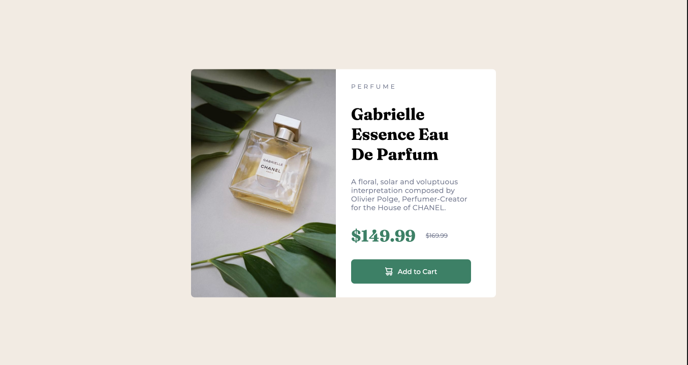
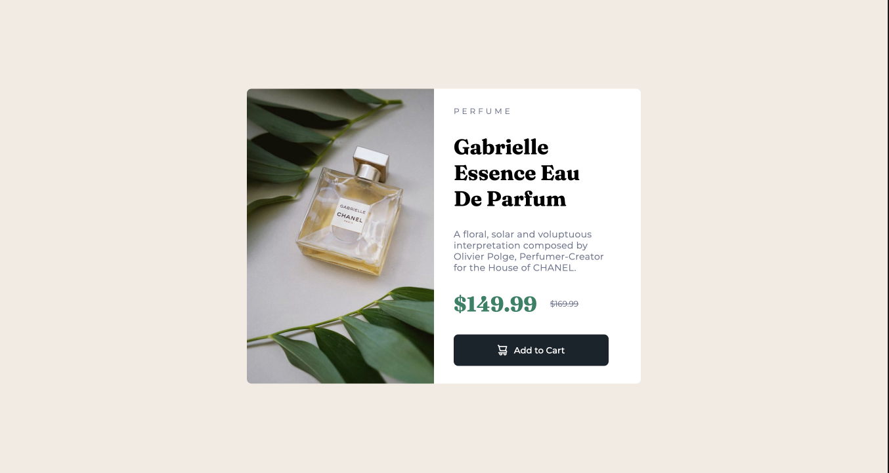

# Frontend Mentor - Product preview card component solution

This is my solution to the [Product preview card component challenge on Frontend Mentor](https://www.frontendmentor.io/challenges/product-preview-card-component-GO7UmttRfa).

## Overview

### The challenge

Users should be able to:

- View the optimal layout depending on their device's screen size
- See hover and focus states for interactive elements

### Screenshot





### Links

### Built with

- Semantic HTML5 markup
- CSS custom properties
- Flexbox
- CSS Grid

### What I learned

- The used of CSS grid.

```css
.small-container {
  width: 600px;
  height: 450px;
  background-color: hsl(0, 0%, 100%);

  display: grid;
  gap: 30px;
  /* DIVE THE CONTAINER IN TO TWO CELLS */
  grid-template-columns: repeat(2, 1fr);

  border-radius: 7px;
}
```

- Using image as a background in one of the grid cell and fit it to the whole space.

```css
.img-container {
  background-image: url("./images/image-product-desktop.jpg");
  background-size: cover;
  border-radius: 7px 0px 0px 7px;
}
```

- At media query -- I learned that I could make 1.5fr as a grid template row, so that the picture has enough space.

```css
.small-container {
  width: 343px;
  height: 611px;

  display: grid;
  grid-template-rows: 1.5fr 2fr;
  grid-template-columns: 1fr;
}
```

- I used width: auto for the description so it could use the whole description container and it could act responsively if the container is changing sizes.

```css
.desc {
  width: auto;
}
```

- I also used width: auto for the button, so the container will be stretched out.

```css
.button-styles {
  width: auto;
}
```

## Author

- LinkedIn - [Maea Matugas](www.linkedin.com/in/maea-matugas)
- Frontend Mentor - [@hollyBelly2021](https://www.frontendmentor.io/profile/hollyBelly2021)
- GitHub - [@hollyBelly2021](https://github.com/hollyBelly2021)

## Acknowledgments

I acknowledge the original author of this challenge.
